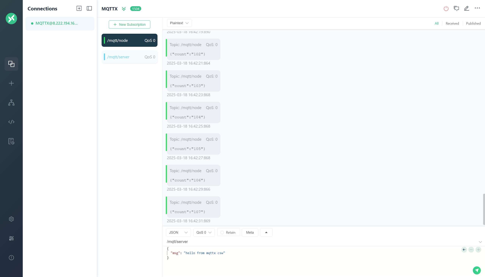

# NOTE

## THEORY

!!! note
    MQTT is a message delivery protocol based on the publish/subscribe pattern. It is a lightweight, simple, open, easy-to-implement protocol that can be used for low-bandwidth network connections. It is a protocol that is very suitable for the Internet of Things because it is a lightweight protocol that can run on low-bandwidth networks. For more detailed information about the ESP32 MQTT implementation, please refer to its official website.

!!! tip
    To use MQTT, the prerequisite is to first implement Wi-Fi or cellular network access to the Internet, and you need an MQTT server. The following links are related reference materials.

> ESP32 Wi-Fi Function

Please refer to the content of the Wi-Fi section of this site.

> MQTT Server

The following link is a project closely related to this project, NEXHUB, which contains the method of building an MQTT server. To use MQTT, you usually need to build an MQTT server first. Therefore, you can build an MQTT server first by following the link below.

-   :material-file:{ .lg .middle } __NEXHUB__

    ---

    [:octicons-arrow-right-24: <a href="https://shuaiwen-cui.github.io/NexHub/IOT-BROKER/EMQX/emqx/" target="_blank"> Portal </a>](#)

> ESP32 MQTT Function

For knowledge, please refer to the following link, and the MQTT implementation can refer to the code of this site.

-   :material-file:{ .lg .middle } __ESP_STUDY__

    ---

    [:octicons-arrow-right-24: <a href="https://shuaiwen-cui.github.io/ESP_STUDY/COMMUNICATION/WIFI/MQTT/mqtt/" target="_blank"> Portal </a>](#)

## DEMO

### message publishing

### message subscription

