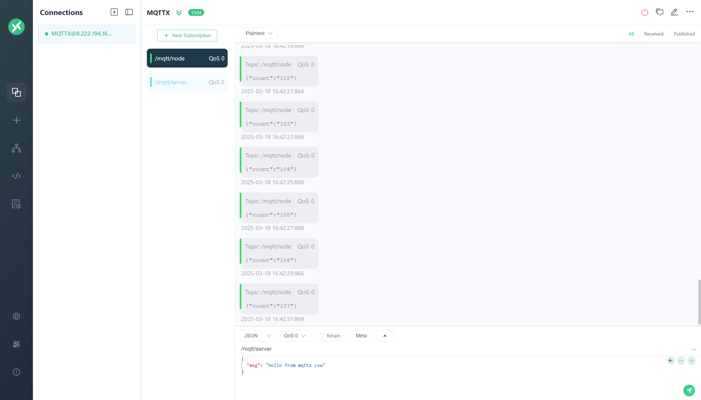
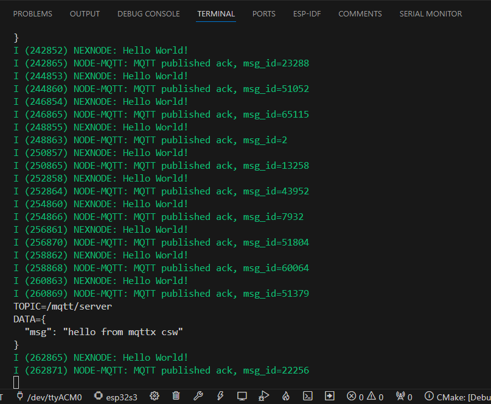

# 笔记

## 理论部分

!!! note
    MQTT 是一种基于发布/订阅模式的消息传递协议，它是一种轻量级的、简单的、开放的、易于实现的、可用于低带宽的网络连接的协议。它是一种非常适合物联网的协议，因为它是一种轻量级的协议，可以在低带宽的网络上运行。更为细致的关于ESP32 MQTT实现的内容可以参考其官方网站。

!!! tip
    想要使用MQTT，其前置条件是需要先实现wifi或者蜂窝网络访问互联网，同时需要有一个MQTT服务器。以下链接是相关参考资料。

> ESP32的wifi功能

请参考本站wifi部分的内容。

> MQTT服务器

下面链接是与本项目密切相关的一个项目，NEXHUB，其中有MQTT服务器的搭建方法。要使用mqtt，通常要先搭建一个mqtt服务器。因此，可以先按照以下链接搭建一个mqtt服务器。

-   :material-file:{ .lg .middle } __NEXHUB__

    ---

    [:octicons-arrow-right-24: <a href="https://shuaiwen-cui.github.io/NexHub/zh/IOT-BROKER/EMQX/emqx/" target="_blank"> Portal </a>](#)

> ESP32的MQTT功能

知识部分请参考以下链接，而mqtt实现可以参考本站代码。

-   :material-file:{ .lg .middle } __ESP_STUDY__

    ---

    [:octicons-arrow-right-24: <a href="https://shuaiwen-cui.github.io/ESP_STUDY/zh/COMMUNICATION/WIFI/MQTT/mqtt/" target="_blank"> Portal </a>](#)

## 效果演示

### 消息发布

### 消息订阅

