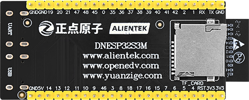

# ALIENTEK DNESP32S3M

## HARDWARE ARCHITECTURE

!!! NOTE "Hardware Architecture"
    MAIN CONTROL + PERCEPTION + COMMUNICATION + ACTUATION + POWER

>Alientek DNESP32S3M Main Control Board

{width=800px}

{width=800px}

## CODE ARCHITECTURE

>General ESP32 Project Structure

```txt
- myProject/
             - CMakeLists.txt
             - sdkconfig
             - components/ - component1/ - CMakeLists.txt
                                         - Kconfig
                                         - src1.c
                           - component2/ - CMakeLists.txt
                                         - Kconfig
                                         - src1.c
                                         - include/ - component2.h
             - main/       - CMakeLists.txt
                           - src1.c
                           - src2.c
             - build/

```
>DNESP32S3M TEMPLATE PROJECT STRUCTURE

```txt
- DNESP32S3M-XXX/
             - .vscode/ (vscode 设置文件，可以忽略)
             - CMakeLists.txt (项目级 cmake 文件)
             - sdkconfig (项目级 sdkconfig 文件，通过 idf.py menuconfig 生成)
             - sdkconfig.old (sdkconfig 备份)
             - partitions-16MiB.csv (16MiB flash 调整的分区表文件)
             - dependencies.lock (依赖库版本锁定文件)
             - application/         - component1/ - CMakeLists.txt
                                                  - Kconfig
                                                  - src1.c
                                    - component2/ - CMakeLists.txt
                                                  - Kconfig
                                                  - src1.c
                                                  - include/ - component2.h
             - middleware/          - component1/ - CMakeLists.txt
                                                  - Kconfig
                                                  - src1.c
                                    - component2/ - CMakeLists.txt
                                                  - Kconfig
                                                  - src1.c
                                                  - include/ - component2.h
             - driver/              - component1/ - CMakeLists.txt
                                                  - Kconfig
                                                  - src1.c
                                    - component2/ - CMakeLists.txt
                                                  - Kconfig
                                                  - src1.c
                                                  - include/ - component2.h
             - main/                - CMakeLists.txt
                                    - src1.c
                                    - src2.c
             - build/


```

!!! NOTE "CODE ARCHITECTURE"
    - application: Application layer, including the main program and the application layer components.
    - middleware: Middleware layer, including middleware components.
    - driver: Driver layer, including driver components.
    - main: Main program, including the main program and the main program components.

>DNESP32S3M PROJECT ACTUAL STRUCTURE (UPDATED IN REALTIME)

```txt
- DNESP32S3M-XXX/
             - .vscode/ (vscode 设置文件，可以忽略)
             - CMakeLists.txt (项目级 cmake 文件)
             - sdkconfig (项目级 sdkconfig 文件，通过 idf.py menuconfig 生成)
             - sdkconfig.old (sdkconfig 备份)
             - partitions-16MiB.csv (16MiB flash 调整的分区表文件)
             - dependencies.lock (依赖库版本锁定文件)
             - application/         - component1/ - CMakeLists.txt
                                                  - Kconfig
                                                  - src1.c
                                    - component2/ - CMakeLists.txt
                                                  - Kconfig
                                                  - src1.c
                                                  - include/ - component2.h
             - middleware/          - component1/ - CMakeLists.txt
                                                  - Kconfig
                                                  - src1.c
                                    - component2/ - CMakeLists.txt
                                                  - Kconfig
                                                  - src1.c
                                                  - include/ - component2.h
             - driver/              - esp_rtc/    - CMakeLists.txt
                                                  - include/ - esp_rtc.h
                                                  - esp_rtc.c
                                    - esp32_mqtt/ - CMakeLists.txt
                                                  - include/ - mqtt.h
                                                  - mqttc.c
                                    - exit/       - CMakeLists.txt
                                                  - include/ - exit.h
                                                  - exit.c
                                    - i2c/        - CMakeLists.txt
                                                  - include/ - i2c.h
                                                  - i2c.c
                                    - lcd/        - CMakeLists.txt
                                                  - include/ - lcd.h
                                                  - lcd.c
                                    - led/        - CMakeLists.txt
                                                  - include/ - led.h
                                                  - led.c
                                    - mpu6050/    - CMakeLists.txt
                                                  - include/ - mpu6050.h
                                                  - mpu6050.c
                                    - rng/        - CMakeLists.txt
                                                  - include/ - rng.h
                                                  - rng.c
                                    - spi/        - CMakeLists.txt
                                                  - include/ - spi.h
                                                  - spi.c
                                    - spi_sdcard/ - CMakeLists.txt
                                                  - include/ - spi_sdcard.h
                                                  - spi_sdcard.c
                                    - tim/        - CMakeLists.txt
                                                  - include/ - tim.h
                                                  - tim.c
                                    - wifi/       - CMakeLists.txt
                                                  - include/ - wifi.h
                                                  - wifi.c
             - main/                - CMakeLists.txt
                                    - main.c

             - build/
```


## DEVELOPMENT SEQUENCE

!!! tip
    For each component, you need to ensure the dependent components are built first. 

1. PROJECT CONSTRRUCTION
2. ACTUATION>LED
3. MAIN-CONTROL>EXIT (External Interrupt)
4. MAIN-CONTROL>TIMER
5. MAIN-CONTROL>RTC
6. MAIN-CONTROL>RNG
7. MAIN-CONTROL>SPI & ACTUATION LCD
8. MAIN-CONTROL>SPI & SD-CARD
9. COMMUNICATION>WIFI
10. COMMUNICATION>IOT
11. MAIN-CONTROL>I2C
12. PERCEPTION>MPU6050

